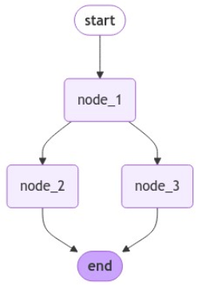
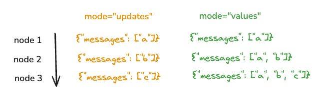
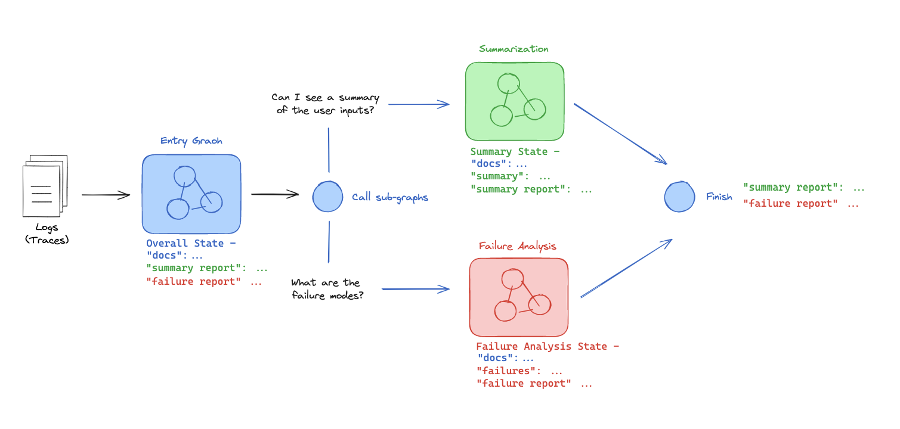
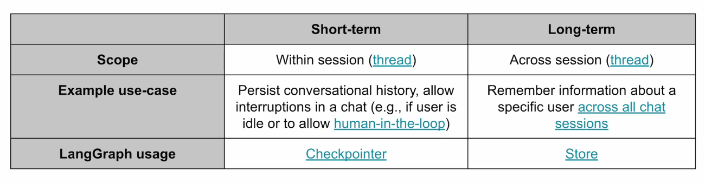
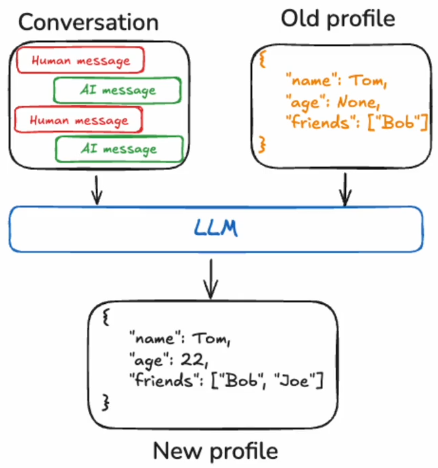
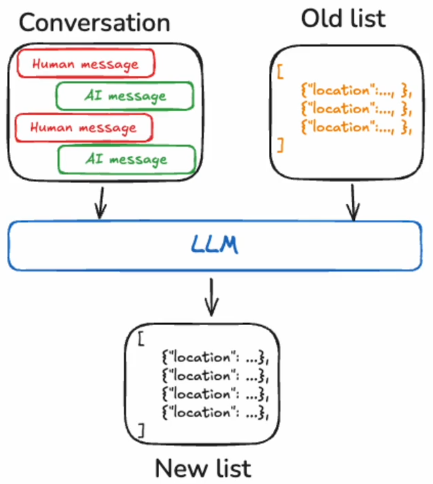
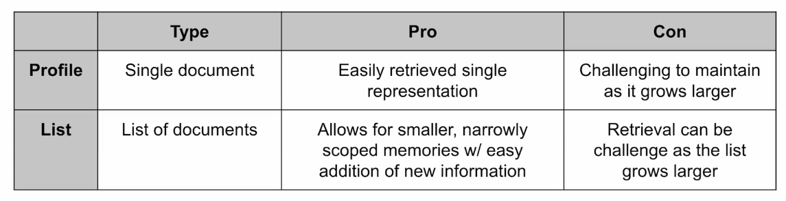
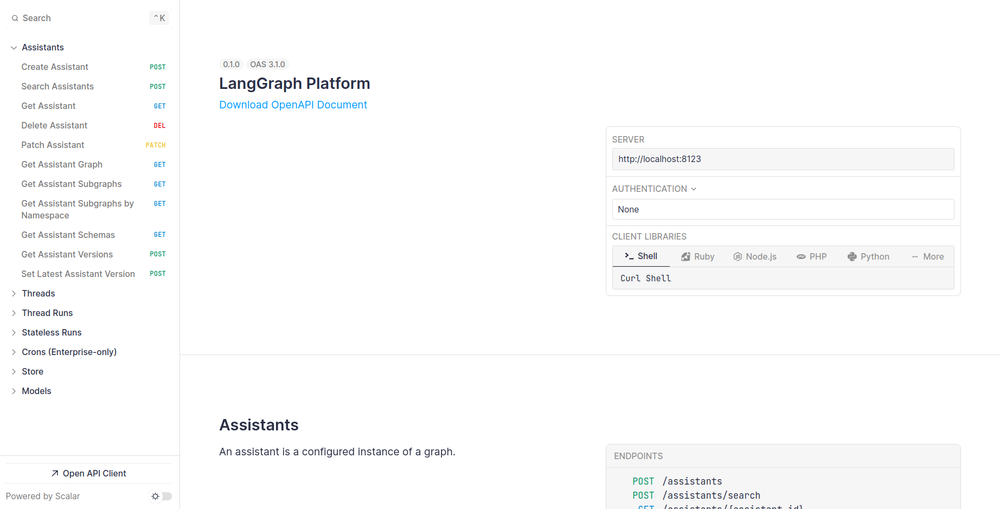
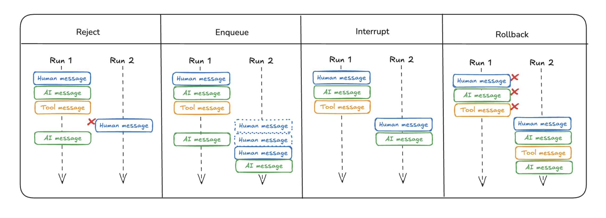

# LangChain

## Agent

+ Agent uses an LLM to determine the control flow of application, deciding what actions to take at different steps. Examples of control include: routing between multiple paths, selecting tools to use, deciding whether a task is complete or needs further processing.

+ Agent architectures:
    + `router`: a basic agent that chooses a single decision among predefined options.
    + `tool-calling Agent`: Agents with advanced capabilities like multi-step decision-making, tool selection, and integration of memory and planning. ReAct is a popular Agent architecture that combines those capabilities. 
        + tool calling: enabling the LLM to choose and utilize appropriate tools as required.
        + memory: allowing the agent to store and leverage information from earlier steps.
        + planning: allowing the LLM to create and follow multi-step plans to achieve goals.

## Multi-Agent

+ problem with single-Agent:
    + Agent has too many tools at its disposal and makes poor decisions about which tool to call next
    + context grows too complex for a single-Agent to keep track of
    + there is a need for multiple specialization areas in the system, like planner, researcher, math expert.

+ benefit of multi-Agent:
    + modularity: separate Agents make it easier to develop, test. and maintain
    + specialization: we can create expert Agents focused on spesific domains
    + control: we can control explicitly control how Agents communicate

+ here for the multi-Agent architecture:
    

    + `network`: each Agent can communicate with every other Agent, and any Agent can choose which one to contact next. if a single Agent can route to any other Agent at any given time, it becomes difficult to maintain control over the system. as a result, this architecture is often unreliable, time-consuming, and costly due to the high volume of calls made to the LLM.
    + `supervisor`: each Agent communicate with with a single supervisor Agent. supervisor Agent makes decisions on which Agent shoul be called next. 
    + `supervisor (tool-calling)`: individual Agent can be represented as tools. a supervisor Agent utilizes a tool-calling LLM to determine which Agent tools to invoke and what arguments to pass to them.
    + `hierarchical`: we might have one supervisor Agent which can call into seperate sub-Agent, but sub-Agent itself is a supervisor Agent. this is really good when we working with a lot sub-Agent and we able to group them in more specialized ways.
    + `custom`: each agent communicates with only a subset of Agents. parts of the flow are deterministic, and only some Agents can decide which other Agents to call next.

+ how Agents communicate?
    

    + graph state (left): share state, so overall state of Agent 1 will pass to Agent.
    + tool calls (right): Agents communicate though tool calling. Agent 1 can send a request to Agent 2, passed only the specific parameters that Agent 2 needs. Agent 2 then uses that information to perform its task and sends the result back to Agent 1 as a response

+ the difference between `supervisor` and `supervisor (tool-calling)` is:
    + `supervisor`: the overall state is passed to sub-Agent
    + `supervisor (tool-calling)`: just passed the specific parameters that sub-Agent need

## LangGraph

### LangGraph Components
+ LangGraph is an extension of LangChain that supports graphs.
+ single and multi-Agent flows are described and represented as graphs.
+ allows for extremely controlled "flows".
+ built-in persistence allows for human-in-the-loop workflows.
+ LangGraph components:
    + nodes: Agents or functions
    + edges: connect nodes
    + conditional edges: decisions
+ data/state:
    + Agent state is accessible to all parts of the graph
    + it is local to the graph
    + can be stored in a persistence layer
    + state schema: represents the structure and types of data that our graph will use. we can use `TypedDict`, `Dataclass`, or `Pydantic`. But they recommendation to use `Pydantic` because it can perform validation to check whether data conforms to the specified types and constrains at runtime.

### Persistence
+ LangGraph's persistence layer uses checkpointers to save the graph state at every super-step, storing these checkpoints in a thread accessible after execution. this enables powerful features like human-in-the-loop interaction.

+ for example we have graph like:

    

    Node 1 branches to Node 2 and Node 3. Node 2 and Node 3 run in parallel, which means they run in the same step of the graph. they both attempt to overwrite the state within the same step. this is ambiguous for the graph! which state should it keep? to handle those problem, we use `reducer` concept. for more detail check the code: [state-schema.py](state-schema.py)

### Streaming
+ LangGraph supports a few different streaming modes for graph state:
    + `values`: this streams the full state of the graph after each node is called.
    + `updates`: this streams updates to the state of the graph after each node is called.

    

### Human-in-the-Loop
+ human-in-the-Loop: interrupt graph execution to approve or edit next action planned by the agent.

+ common interaction patterns include:
    + `Approval`: pause the agent, show its current state to the user, and let the user approve an action.
    + `Editing`: pause the agent, show its current state, and allow the user to modify it.
    + `Debugging`: rewind the graph to reproduce or avoid issues.

### Sub-graphs
+ sub-graphs make it possible to organize and control different states within separate parts of your graph. this is particularly helpful in multi-agent systems, where each team of agents operates with its own state.
+ for example: 
    + we have a system that accept logs
    + it performs two seperate sub-tasks by different Agents called summarize logs and find failure modes
    + we want to perform these two operations in two different sub-graphs.

    the communication between main graph and sub-graph: the sub-graphs can access `docs` from the main graph, and the main graph can access `summary` or `failure_report` from the sub-graphs. the communication is illustrated in the picture below.

    

### Map-reduce
+ map-reduce operations are essential for effecient task decomposition and parallel processing. map-reduce have two phases:
    1. `map`: break a task into smaller sub-tasks, processing each sub-task in parallel.
    2. `reduce`: aggregate the results across all of the completed sub-tasks.
    
### Memory: short-term vs. long-term
+ here for comparison between short and long:


+ for long-term, there are two types: 
    + profile
    

    + collection
    

    + comparison between those types:
    

### Deployment
+ install langgraph-cli
```
pip3 install langgraph-cli
```
+ then build docker image
```
cd deployment/
langgraph build -t my-image
```
+ setting docker image name, langsmith api key, and openai api key in docker-compose.yml
+ next, run:
```
docker compose up -d
```
+ if done, see the deployment result in http://localhost:8123/docs


### Double texting input
+ many times users might interact with your graph in unintended ways. for instance, a user may send one message and before the graph has finished running send a second message. more generally, users may invoke the graph a second time before the first run has finished. we call this "double texting".
+ LangGraph have fews schema to handle double texting input, namely as follows:
    + reject: a simple approach is to reject any new runs until the current run completes.
    + enqueue: we can use enqueue any new runs until the current run completes.
    + interrupt: we can use interrupt to interrupt the current run, but save all the work that has been done so far up to that point.
    + rollback: we can use rollback to interrupt the prior run of the graph, delete it, and start a new run with the double-texted input.
    
+ you can see the code example in [double-texting-input.ipynb](double-texting-input.ipynb) 

### Assistent
+ if we want to separate the role, for example we want one assistant for personal tasks and another for work tasks, then we can use the following example code to implement it: [assistent.ipynb](assistent.ipynb) 

## Reference:
+ https://langchain-ai.github.io/langgraph/concepts/agentic_concepts/
+ https://learn.deeplearning.ai/courses/ai-agents-in-langgraph
+ https://www.youtube.com/watch?v=4nZl32FwU-o&t=322s
+ https://academy.langchain.com/courses/intro-to-langgraph
+ https://learn.deeplearning.ai/courses/functions-tools-agents-langchain